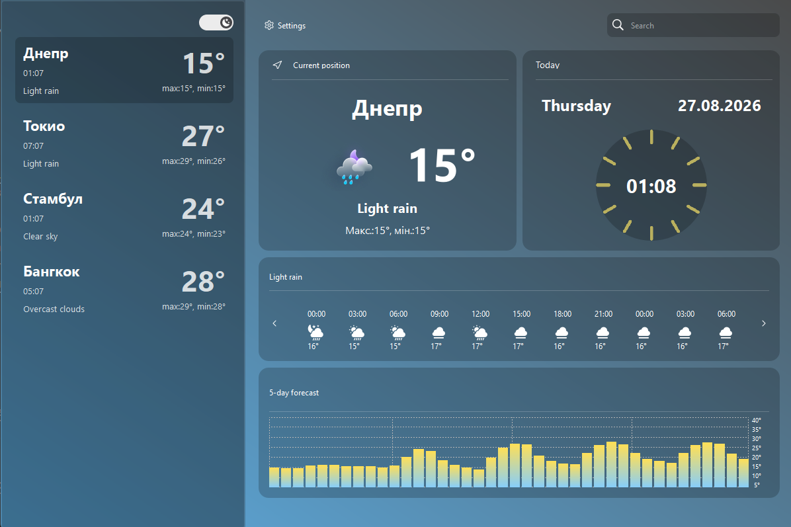
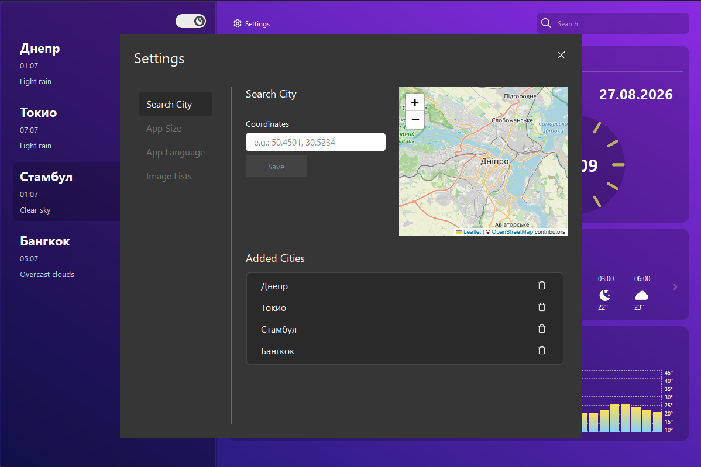

# 🌤️ Weather App

<p align="center">
  <strong>Десктопний застосунок для перегляду поточної погоди та прогнозу погоди для обраних міст.</strong>
</p>

<p align="center">
  Застосунок розроблений на Python з використанням PyQt6 та погодного API. Інтерфейс підтримує декілька мов, зміну теми, вибір розміру вікна та набору зображень.
</p>

---

## 📑 Зміст

* 🖥️ [Інтерфейс](#-інтерфейс)
* ⚙️ [Основні можливості](#️-основні-можливості)
* 🌐 [API](#-api)
* 📁 [Файли конфігурації](#-файли-конфігурації)
* 👨‍💻 [Про розробника](#-про-розробника)
* 🚀 [Встановлення та запуск](#-встановлення-та-запуск)
* 📌 [Висновок](#-висновок)

---

## 🖥️ Інтерфейс

<p align="center">
  
</p>

<p align="center">
  
</p>

---

## ⚙️ Основні можливості

Застосунок має такі можливості:

* 🌡️ Перегляд поточної температури.
* 🌦️ Перегляд опису погодних умов.
* 📅 Перегляд прогнозу погоди.
* 🌡️ Перегляд мінімальної та максимальної температури.
* 🏙️ Додавання міст до списку.
* 🗑️ Видалення міст зі списку.
* 📍 Пошук міста за координатами.
* 🌙 Перемикання між світлою та темною темами.
* 🌐 Підтримка української та англійської мов.
* 🖼️ Вибір набору зображень для інтерфейсу.
* 📐 Зміна розміру застосунку.
* 💾 Автоматичне збереження налаштувань.
* 🔄 Збереження вибраного міста після перезапуску застосунку.

---

## 🌐 API

Для отримання погодних даних у застосунку використовується **OpenWeatherMap API**.

API використовується для отримання:

* 🌡️ поточної температури;
* 📉 мінімальної та максимальної температури;
* 🌦️ опису погодних умов;
* 🖼️ іконки погоди;
* 🕐 локального часу та часового поясу;
* 📅 прогнозу погоди;
* 📍 погодних даних за координатами.

Для роботи з API використовується персональний API-ключ, який зберігається у файлі `.env`:

```env
API_KEY=your_api_key
```

Вебсайт API: **[OpenWeatherMap](https://openweathermap.org/)**

---

## 📁 Файли конфігурації

Застосунок використовує два основні файли конфігурації:

### `.env`

Файл `.env` використовується для зберігання секретних даних, наприклад API-ключа.

```env
API_KEY=your_api_key
```

### `config.json`

config.json використовується для збереження налаштувань користувача.

У ньому можуть зберігатися:

```json
{
    "list_city": [],
    "selected_city": "",
    "is_dark": false,
    "window_size": "1200x800",
    "image_pack": "pack1",
    "language": "ua"
}
```

Завдяки цьому після повторного запуску застосунку користувач не повинен налаштовувати програму заново.

---

## 👨‍💻 Про розробника

**Ім'я:** Панков Михайло

**Роль:** Python Developer

**GitHub:** https://github.com/nevdaha99

Проєкт був розроблений для практики роботи з Python, PyQt6, API, JSON-конфігураціями та побудови графічного інтерфейсу десктопного застосунку.

---

## 🚀 Встановлення та запуск

### 1. Клонування репозиторію

```bash
git clone <посилання-на-репозиторій>
```

Перейдіть до папки проєкту:

```bash
cd weather-app
```

### 2. Створення віртуального середовища

**Windows:**

```bash
python -m venv venv
```

Активація:

```bash
venv\Scripts\activate
```

### 3. Встановлення залежностей

Встановіть необхідні бібліотеки:

```bash
pip install -r requirements.txt
```

### 4. Налаштування `.env`

Створіть файл `.env` у кореневій папці проєкту:

```env
API_KEY=your_api_key
```

Вставте замість `your_api_key` власний API-ключ.

### 5. Запуск

Запустіть головний файл застосунку:

```bash
python main.py
```

---

## 📌 Висновок

**Weather App — це десктопний застосунок для перегляду погоди, створений на Python та PyQt6.**

Під час розробки були реалізовані робота з OpenWeatherMap API, отримання погодних даних, графічний інтерфейс, система налаштувань, збереження конфігурації, підтримка різних мов і тем, а також можливість змінювати розмір застосунку.

Проєкт може бути розширений додаванням нових погодних показників, прогнозу на більший період, підтримки додаткових мов, адаптації під iOS та Android та інших функцій.
